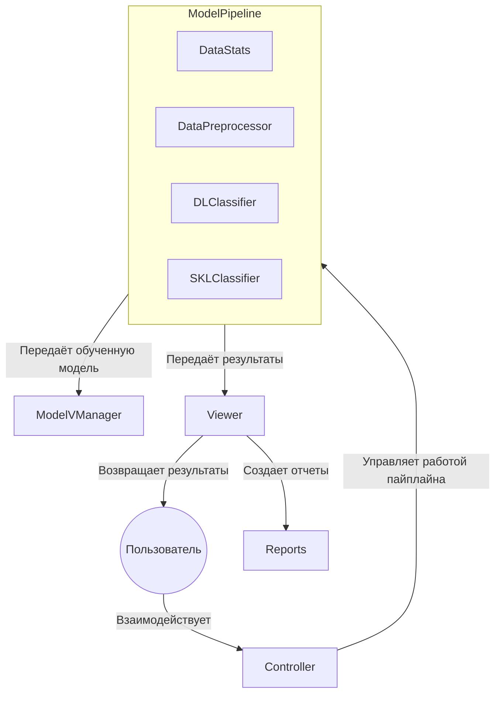

# Backblaze MLOps

## Описание системы

Данная система предназначена для анализа данных о жестких дисках, предоставленных компанией Backblaze. Она включает в себя полный цикл обработки данных: от их сбора и предобработки до обучения моделей машинного обучения и генерации прогнозов. В системе используются модели анализа выживаемости для оценки вероятности отказа дисков.
### Основные компоненты системы

1. **Сбор данных**:
   - Данные разбиваются на батчи для удобства обработки.
   - Хранение данных организовано в файловой системе.
   - Конфигурация сборщика при помощи JSON-файла

2. **Анализ данных**:
   - Оценка качества данных (например, проверка на пропуски).
   - Очистка данных от выбросов и некорректных значений.

3. **Подготовка данных**:
   - Обработка пропущенных значений.
   - Кодирование категориальных признаков.
   - Нормализация числовых признаков.

4. **Обучение модели**:
   - Поддерживается обучение и дообучение моделей.
   - Доступны две модели - логистическая регрессия и многслойный персептрон.
   - Конфигурация модели при помощи JSON-файла

5. **Валидация модели**:
   - Оценка качества модели на отложенной выборке.
   - Хранение версий моделей для воспроизводимости.

6. **Обслуживание модели**:
   - Сериализация обученных моделей для последующего использования.

7. **Управление**:
   - Поддержка аргументов командной строки для управления.
   - Использование Sphinx для автоматической генерации документации
   - Автоматизированные тесты

## Установка

1. Клонируйте репозиторий:

    ```bash
    git clone git@github.com:dvarfe/Backblaze_ML_Ops.git
    ```

2. Установите зависимости с помощью `pipenv`:

    ```bash
    pipenv install --dev
    ```

## Запуск программы

Для запуска системы используйте следующую команду:

```bash
python main.py
```

## Основные команды

### Сбор данных (collect_data)

Собирает данные из указанных путей с разбиением на батчи заданного размера. Результаты сохраняются в указанной директории.

**Пример использования:**

```bash
python main.py collect_data --paths /Data/Sources/1 /Data/Sources/2 --batchsize 100000 --storage_path ./Data/Data_collected
```

### Анализ данных (data_stats)

Выполняет расчет статистик по данным

**Пример использования:**

```bash
python main.py data_stats --static_metrics size,missing_values --dynamic_metrics failure_rate --figpath ./Reports --freq daily
```

## Сценарии использования системы

### 1. Полный цикл обучения модели

Этот сценарий демонстрирует процесс от сбора данных до сохранения обученной модели в интерактивном режиме.

```bash
# Запуск программы
python main.py

# Сбор данных из указанных источников с разбиением на батчи
>> collect_data Data/Sources --batchsize 100000 --storage_path ./Data/Data_collected

# Расчет статистик по собранным данным 
>> data_stats -s data_size min_date max_lifetime mean_lifetime failure_rate mean_observ_per_day

# Предобработка данных: очистка и подготовка для обучения
>> preprocess

# Обучение модели с использованием конфигурационного файла и подготовленных данных
>> fit -m NN

# Оценка качества обученной модели на тестовой выборке
>> score_model ./Data/preprocessed/train/0_preprocessed.csv

# Сохранение обученной модели в указанное место
>> save_model -p ./Models/default.pkl 

>> exit
```

### 2. Дообучение предварительно сохранённой модели

Этот сценарий демонстрирует дообучение модели и использование функции `save_best_model` для сохранения лучшей версии модели.

```bash
# Запуск программы
python main.py 

# Загрузка предварительно сохранённой модели и данных для дообучения
>> load_model -p ./Models/default.pkl

# Дообучение модели 
>> fine_tune -p ./Data/preprocessed/

# Сохранение лучшей версии модели по метрике ci
>> save_best_model -m ci
```

## Структура проекта

- `Config/`: Конфигурационные файлы.
- `Data/`: Данные (сырые и предобработанные).
- `disk_analyzer/`: Основной модуль системы.
- `docs/`: Документация.
- `Models/`: Сохраненные модели.
- `Predictions/`: Результаты прогнозов.
- `Reports/`: Отчеты.
- `tests/`: Тесты для проверки функциональности системы.

## Диаграмма системы



