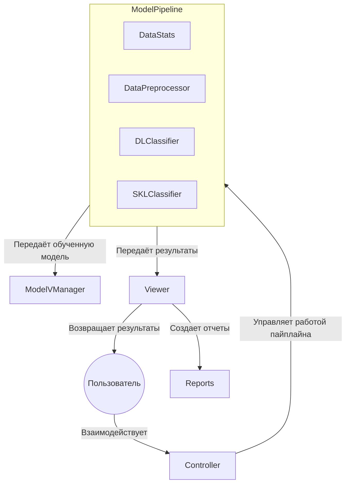

# Backblaze MLOps

## Описание системы

Данная система предназначена для анализа данных о жестких дисках, предоставленных компанией Backblaze. Она включает в себя полный цикл обработки данных: от их сбора и предобработки до обучения моделей машинного обучения и генерации прогнозов. В системе используются модели анализа выживаемости для оценки вероятности отказа дисков.
### Основные компоненты системы

1. **Сбор данных**
2. **Анализ данных**
3. **Подготовка данных**
4. **Обучение модели**
   - Поддерживается обучение и дообучение моделей
5. **Валидация модели**
   - Оценка качества модели на отложенной выборке.
   - Хранение версий моделей для воспроизводимости.
6. **Обслуживание модели**
   - Сериализация обученных моделей для последующего использования.
7. **CI/CD**
   - Автоматическое выполнение тестов при push/pull request;
   - Сохранение логов
   - Сохранение сериализованной модели
## Установка

1. Клонируйте репозиторий:

    ```bash
    git clone git@github.com:dvarfe/Backblaze_ML_Ops.git
    ```

2. Установите зависимости с помощью `pipenv`:

    ```bash
    pipenv install --dev
    ```

## Запуск программы

Для запуска системы используйте следующую команду:

```bash
python main.py
```

## Основные команды

### Сбор данных (collect_data)

Собирает данные из указанных путей с разбиением на батчи заданного размера. Результаты сохраняются в указанной директории.

**Пример использования:**

```bash
python main.py collect_data --paths /Data/Sources/1 /Data/Sources/2 --batchsize 100000 --storage_path ./Data/Data_collected
```

### Анализ данных (data_stats)

Выполняет расчет статистик по данным

**Пример использования:**

```bash
python main.py data_stats --static_metrics size,missing_values --dynamic_metrics failure_rate --figpath ./Reports --freq daily
```

## Сценарии использования системы

### 1. Полный цикл обучения модели

Этот сценарий демонстрирует процесс от сбора данных до сохранения обученной модели в интерактивном режиме.

```bash
# Запуск программы
python main.py

# Сбор данных из указанных источников с разбиением на батчи
>> collect_data Data/Sources --batchsize 100000 --storage_path ./Data/Data_collected

# Расчет статистик по собранным данным 
>> data_stats -s data_size min_date max_lifetime mean_lifetime failure_rate mean_observ_per_day

# Предобработка данных: очистка и подготовка для обучения
>> preprocess

# Обучение модели с использованием конфигурационного файла и подготовленных данных
>> fit -m NN

# Оценка качества обученной модели на тестовой выборке
>> score_model ./Data/preprocessed/train/0_preprocessed.csv

# Сохранение обученной модели в указанное место
>> save_model -p ./Models/default.pkl 

>> exit
```

### 2. Дообучение предварительно сохранённой модели

Этот сценарий демонстрирует дообучение модели и использование функции `save_best_model` для сохранения лучшей версии модели.

```bash
# Запуск программы
python main.py 

# Загрузка предварительно сохранённой модели и данных для дообучения
>> load_model -p ./Models/default.pkl

# Дообучение модели 
>> fine_tune -p ./Data/preprocessed/

# Сохранение лучшей версии модели по метрике ci
>> save_best_model -m ci
```

## Структура проекта

- `Config/`: Конфигурационные файлы.
- `Data/`: Данные (сырые и предобработанные).
- `disk_analyzer/`: Основной модуль системы.
- `docs/`: Документация.
- `Models/`: Сохраненные модели.
- `Predictions/`: Результаты прогнозов.
- `Reports/`: Отчеты.
- `tests/`: Тесты для проверки функциональности системы.

## Диаграмма системы



## CI/CD и автоматизация

В проекте настроены два workflow для автоматизации процессов разработки и обучения моделей:

1. **CI/CD Pipeline** ([`.github/workflows/main.yml`](.github/workflows/main.yml)):
   - Запускается при каждом пуше или pull request в ветку `main`.
   - Выполняет следующие шаги:
     - Установка зависимостей.
     - Запуск автоматических тестов с использованием `pytest`.
     - Обучение модели после успешного прохождения тестов.
     - Сохранение логов обучения как артефактов.

2. **Background Training** ([`.github/workflows/background.yml`](.github/workflows/background.yml)):
   - Запускается вручную через `workflow_dispatch`.
   - Позволяет указать количество итераций обучения через входной параметр.
   - Выполняет следующие шаги:
     - Установка зависимостей.
     - Запуск скрипта обучения с дообучением.
     - Сохранение лучшей модели и отчета как артефактов.
